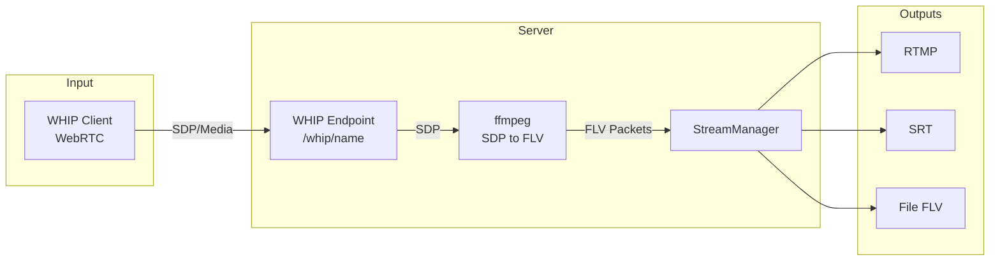

# RTMP/SRT/WHIP Server Manager

A server for relaying RTMP streams with SRT output support, WHIP (WebRTC-HTTP Ingest Protocol) support, and a web management interface.

## Features

- 📥 Accepts RTMP, SRT, and WHIP streams
- 📤 Relays to RTMP and SRT outputs
- 💾 Writes streams to FLV files
- 🌐 Web management interface
- 🔧 Dynamic management of inputs and outputs (add/remove/force reconnect without restart)
- 🔄 Universal fallback for RTMP output from SRT (automatic PID detection by content, robust to missing PMT/PAT, supports any PID)
- 📊 Status and statistics monitoring
- ⚙️ SRT parameter configuration
- 🔄 Automatic reconnection and manual force reconnect

## Getting Started

1. Build the server:
```bash
go build -o rtmpserver.exe .
```

2. Run the server:
```bash
./rtmpserver.exe
```

3. Open the web interface in your browser:
```
http://localhost:8080
```

## Web Interface

### Authentication
- **Login:** admin
- **Password:** secret

### Tabs

#### 📊 Status
- Overall status of all inputs and outputs
- Bitrate and uptime statistics
- Activity indicators

#### 📥 Inputs
- Add new RTMP inputs
- Remove existing inputs
- View input list

#### 📤 Outputs
- Add outputs (RTMP/SRT)
- Remove outputs
- Force reconnect
- SRT parameter management

#### ⚙️ Settings
- Global SRT settings (latency, passphrase, streamid)
- Logging settings
- Reconnect interval

## API Endpoints

### Inputs
- `GET /api/inputs` - list inputs
  - **Example request:**
    ```bash
    curl -u admin:secret http://localhost:8080/api/inputs
    ```
- `POST /api/inputs/add` - add input
  - **Example request:**
    ```bash
    curl -u admin:secret -X POST http://localhost:8080/api/inputs/add \
      -H 'Content-Type: application/json' \
      -d '{"name":"obs","url_path":"/live/stream","outputs":["rtmp://...","srt://..."]}'
    ```
- `GET /api/inputs/remove?name=...` - remove input
  - **Example request:**
    ```bash
    curl -u admin:secret "http://localhost:8080/api/inputs/remove?name=obs"
    ```
- `POST /api/inputs/update_outputs` - update outputs for input
  - **Example request:**
    ```bash
    curl -u admin:secret -X POST http://localhost:8080/api/inputs/update_outputs \
      -H 'Content-Type: application/json' \
      -d '{"name":"obs","outputs":["rtmp://...","srt://..."]}'
    ```

### Status
- `GET /api/status/all` - status of all inputs
  - **Example request:**
    ```bash
    curl -u admin:secret http://localhost:8080/api/status/all
    ```
- `GET /api/status?name=...` - status of a specific input
  - **Example request:**
    ```bash
    curl -u admin:secret "http://localhost:8080/api/status?name=obs"
    ```

### Outputs
- `POST /api/outputs/add` - add output
  - **Example request:**
    ```bash
    curl -u admin:secret -X POST http://localhost:8080/api/outputs/add \
      -H 'Content-Type: application/json' \
      -d '{"name":"obs","url":"rtmp://example.com/live/stream"}'
    ```
- `POST /api/outputs/remove` - remove output
  - **Example request:**
    ```bash
    curl -u admin:secret -X POST http://localhost:8080/api/outputs/remove \
      -H 'Content-Type: application/json' \
      -d '{"name":"obs","url":"rtmp://example.com/live/stream"}'
    ```
- `POST /api/outputs/reconnect` - force reconnect output
  - **Example request:**
    ```bash
    curl -u admin:secret -X POST http://localhost:8080/api/outputs/reconnect \
      -H 'Content-Type: application/json' \
      -d '{"name":"obs","url":"rtmp://example.com/live/stream"}'
    ```

### Settings
- `GET /api/settings` - get settings
  - **Example request:**
    ```bash
    curl -u admin:secret http://localhost:8080/api/settings
    ```
- `PUT /api/settings` - update settings
  - **Example request:**
    ```bash
    curl -u admin:secret -X PUT http://localhost:8080/api/settings \
      -H 'Content-Type: application/json' \
      -d '{"srt_settings":{"latency":200}}'
    ```
- `POST /api/settings/reload` - reload from file
  - **Example request:**
    ```bash
    curl -u admin:secret -X POST http://localhost:8080/api/settings/reload
    ```

## Configuration

Main settings are stored in `config.yaml`:

```yaml
server:
  port: 8080
  rtmp_port: 1935
  api_username: admin
  api_password: secret

srt_settings:
  latency: 120
  connect_timeout: 5000
  passphrase: ""
  streamid: ""
  encryption: "none"

log_to_file: true
log_file: "server.log"
reconnect_interval: 5

whip_settings:
  ice_servers:
    - "stun:stun.l.google.com:19302"

# Example of inputs
# You can also add/remove them via the web interface
inputs:
  - name: obs_stream
    url_path: /live/obs
    outputs:
      - rtmp://a.rtmp.youtube.com/live2
      - srt://some.srt.server:9000
      - file://records/my_stream.flv
```

The server can start with an empty `inputs` list, and they can be added later via the web interface or API.

## Project Structure

```
go project/
├── main.go              # Main server file
├── api.go               # API handlers
├── config.go            # Configuration
├── stream_manager.go    # Stream management
├── publish_handler.go   # RTMP handling
├── srt_server.go        # SRT handling
├── config.yaml          # Configuration file
├── web/                 # Web interface
│   ├── index.html       # Main page
│   └── app.js           # JavaScript logic
└── README.md            # Documentation
```

## Usage

1. **Add input:**
   - Go to the "Inputs" tab
   - Enter name and RTMP path
   - Add outputs (optional)
   - Click "Add input"

2. **Add output:**
   - Go to the "Outputs" tab
   - Select input
   - Enter output URL (RTMP or SRT)
   - Click "Add output"

3. **Force reconnect output:**
   - On the "Outputs" tab, use the "Reconnect" button next to the desired output
   - Or call the API `/api/outputs/reconnect` with the required parameters

4. **Monitoring:**
   - Go to the "Status" tab
   - Track input and output activity
   - View bitrate statistics

5. **Settings:**
   - Go to the "Settings" tab
   - Change SRT parameters
   - Configure logging
   - Save changes

## Supported Formats

### Inputs
- RTMP (rtmp://server/app/stream)
- SRT (srt://server:port/streamId)

### Outputs
- RTMP (rtmp://server/app/stream)
- SRT (srt://server:port?streamid=...)
- File recording:
  - `.mp4` (fragmented MP4 via ffmpeg, zero CPU load, crash-resilient)
  - `.flv` / `.ts` (raw stream saving)

## SRT Input/Output Examples

### SRT Input Example
- OBS/ffmpeg can send SRT to your server:
  - `srt://your-server:9000?streamid=obs`
  - Add this as an input in the web UI or config.
  - **API example:**
    ```bash
    curl -u admin:secret -X POST http://localhost:8080/api/inputs/add \
      -H 'Content-Type: application/json' \
      -d '{"name":"obs","url_path":"/live/stream","outputs":["rtmp://...","srt://..."]}'
    ```

### SRT Output Example
- You can add SRT output for any input:
  - `srt://destination-server:port?streamid=yourstream`
  - Add via web UI or API:
    ```bash
    curl -u admin:secret -X POST http://localhost:8080/api/outputs/add \
      -H 'Content-Type: application/json' \
      -d '{"name":"obs","url":"srt://destination-server:9000?streamid=yourstream"}'
    ```

## Troubleshooting

### Black screen or no video on RTMP output
- Make sure your encoder (OBS/ffmpeg) sends keyframes at least every 1-2 seconds (set Keyframe Interval = 2s in OBS).
- If using SRT input, the server will wait for the first keyframe before starting RTMP output.
- If you see a long delay before video appears, check your VPN/proxy and try disabling it.

### High latency (delay > 10-12 seconds)
- This is normal for public RTMP/CDN platforms (VK, YouTube, etc.).
- Try disabling VPN, lowering SRT latency in config (but not below 60-80 ms), and setting Keyframe Interval = 1-2s in OBS.
- For ultra-low latency, use SRT or WebRTC end-to-end (not possible with public CDN).

### No audio or video on output
- Check that your input stream contains both audio and video tracks.
- The server supports even "broken" TS streams (missing PMT/PAT, arbitrary PIDs) thanks to universal fallback.

### RTMP output stops or reconnects frequently
- Check your network stability and CDN health.
- If you see "RTMP Output buffer full" in logs, increase the output buffer size in the code.

### SRT timestamp conversion errors в VLC
- Исправлено в версии 1.2+: добавлена нормализация временных меток для SRT выходов
- Если видите ошибки типа "Could not convert timestamp 1198778360812 for faad" - обновите сервер
- Нормализация временных меток происходит относительно первого ключевого кадра
- Проверьте логи на наличие "SRT base time set to: [время]" для подтверждения работы

## Universal Fallback for RTMP from SRT

The server automatically detects video/audio PIDs by content, even if the incoming SRT/TS stream is missing PMT/PAT tables or uses non-standard PIDs. This ensures maximum compatibility with streams from OBS, ffmpeg, hardware encoders, and other sources.

## WHIP (WebRTC-HTTP Ingest Protocol) support

Проект поддерживает приём WebRTC-потоков по протоколу WHIP (endpoint: `/whip/{name}`).

### Как это работает

- При подключении клиента по WHIP сервер создаёт отдельный процесс ffmpeg.
- ffmpeg получает медиа-поток по WebRTC (SDP) и преобразует его в стандартный поток (FLV), который далее обрабатывается системой.
- После этого поток автоматически направляется на все выходы, указанные в конфиге для данного input (RTMP, SRT, запись в файл и т.д.).
- Для каждого входа создаётся отдельный ffmpeg-процесс, что обеспечивает изоляцию и стабильность обработки.

**Схема работы:**

### WHIP Flow Diagram



### Требования к ffmpeg
Для работы WHIP необходим ffmpeg, собранный с поддержкой следующих опций:

```
--prefix=/mingw64
--disable-everything
--enable-protocol='pipe,rtmp,file'
--enable-demuxer=rtp
--enable-decoder=opus
--enable-muxer=flv
--enable-encoder=libfdk_aac
--enable-network
--enable-gpl
--enable-nonfree
--enable-libfdk-aac
--enable-small
--disable-doc
--disable-ffplay
--disable-ffprobe
--disable-postproc
--disable-avdevice
--disable-swscale
--disable-debug
--enable-swresample
--disable-shared
--enable-static
--extra-cflags=-static
--extra-ldflags=-static
--pkg-config-flags=--static
--enable-filter='aformat,anull,atrim,aresample'
--enable-parser=h264
--enable-demuxer=h264
--enable-bsfs
--enable-bsf=h264_mp4toannexb
--enable-bsf=extract_extradata
```

### Пример запроса

```
POST /whip/obs_whip HTTP/1.1
Content-Type: application/sdp

v=0
...
```

Поток будет автоматически обработан и направлен на все выходы, указанные в конфиге для данного input.

# Русская версия

Сервер для ретрансляции RTMP-потоков с поддержкой SRT-выходов и веб-интерфейсом управления.

## Возможности

- 📥 Прием RTMP, SRT и WHIP потоков
- 📤 Ретрансляция в RTMP и SRT
- 💾 Запись потоков в FLV-файлы
- 🌐 Веб-интерфейс управления 
- 🔧 Динамическое управление входами и выходами (добавление/удаление/force reconnect без рестарта)
- 🔄 Универсальный fallback для RTMP-выхода из SRT (автоматическое определение PID по содержимому, устойчивость к отсутствию PMT/PAT, поддержка любых PID)
- 📊 Мониторинг статуса и статистики
- ⚙️ Настройка параметров SRT
- 🔄 Автоматическое переподключение и ручной force reconnect

## Запуск

1. Скомпилируйте сервер:
```bash
go build -o rtmpserver.exe .
```

2. Запустите сервер:
```bash
.\rtmpserver.exe
```

3. Откройте веб-интерфейс в браузере:
```
http://localhost:8080
```

## Веб-интерфейс

### Авторизация
- **Логин:** admin
- **Пароль:** secret

### Вкладки

#### 📊 Статус
- Общий статус всех входов и выходов
- Статистика битрейта и аптайма
- Индикаторы активности

#### 📥 Входы
- Добавление новых RTMP-входов
- Удаление существующих входов
- Просмотр списка входов

#### 📤 Выходы
- Добавление выходов (RTMP/SRT)
- Удаление выходов
- Принудительный реконнект (force reconnect)
- Управление параметрами SRT

#### ⚙️ Настройки
- Глобальные настройки SRT (latency, passphrase, streamid)
- Настройки логирования
- Интервал переподключения

## API Endpoints

### Inputs
- `GET /api/inputs` - список входов
  - **Пример запроса:**
    ```bash
    curl -u admin:secret http://localhost:8080/api/inputs
    ```
- `POST /api/inputs/add` - добавить вход
  - **Пример запроса:**
    ```bash
    curl -u admin:secret -X POST http://localhost:8080/api/inputs/add \
      -H 'Content-Type: application/json' \
      -d '{"name":"obs","url_path":"/live/stream","outputs":["rtmp://...","srt://..."]}'
    ```
- `GET /api/inputs/remove?name=...` - удалить вход
  - **Пример запроса:**
    ```bash
    curl -u admin:secret "http://localhost:8080/api/inputs/remove?name=obs"
    ```
- `POST /api/inputs/update_outputs` - обновить выходы для входа
  - **Пример запроса:**
    ```bash
    curl -u admin:secret -X POST http://localhost:8080/api/inputs/update_outputs \
      -H 'Content-Type: application/json' \
      -d '{"name":"obs","outputs":["rtmp://...","srt://..."]}'
    ```

### Status
- `GET /api/status/all` - статус всех входов
  - **Пример запроса:**
    ```bash
    curl -u admin:secret http://localhost:8080/api/status/all
    ```
- `GET /api/status?name=...` - статус конкретного входа
  - **Пример запроса:**
    ```bash
    curl -u admin:secret "http://localhost:8080/api/status?name=obs"
    ```

### Outputs
- `POST /api/outputs/add` - добавить выход
  - **Пример запроса:**
    ```bash
    curl -u admin:secret -X POST http://localhost:8080/api/outputs/add \
      -H 'Content-Type: application/json' \
      -d '{"name":"obs","url":"rtmp://example.com/live/stream"}'
    ```
- `POST /api/outputs/remove` - удалить выход
  - **Пример запроса:**
    ```bash
    curl -u admin:secret -X POST http://localhost:8080/api/outputs/remove \
      -H 'Content-Type: application/json' \
      -d '{"name":"obs","url":"rtmp://example.com/live/stream"}'
    ```
- `POST /api/outputs/reconnect` - принудительный реконнект выхода
  - **Пример запроса:**
    ```bash
    curl -u admin:secret -X POST http://localhost:8080/api/outputs/reconnect \
      -H 'Content-Type: application/json' \
      -d '{"name":"obs","url":"rtmp://example.com/live/stream"}'
    ```

### Settings
- `GET /api/settings` - получить настройки
  - **Пример запроса:**
    ```bash
    curl -u admin:secret http://localhost:8080/api/settings
    ```
- `PUT /api/settings` - обновить настройки
  - **Пример запроса:**
    ```bash
    curl -u admin:secret -X PUT http://localhost:8080/api/settings \
      -H 'Content-Type: application/json' \
      -d '{"srt_settings":{"latency":200}}'
    ```
- `POST /api/settings/reload` - перезагрузить из файла
  - **Пример запроса:**
    ```bash
    curl -u admin:secret -X POST http://localhost:8080/api/settings/reload
    ```

## Конфигурация

Основные настройки хранятся в `config.yaml`:

```yaml
server:
  port: 8080
  rtmp_port: 1935
  api_username: admin
  api_password: secret

srt_settings:
  latency: 120
  connect_timeout: 5000
  passphrase: ""
  streamid: ""
  encryption: "none"

log_to_file: true
log_file: "server.log"
reconnect_interval: 5

whip_settings:
  ice_servers:
    - "stun:stun.l.google.com:19302"

# Example of inputs
# You can also add/remove them via the web interface
inputs:
  - name: obs_stream
    url_path: /live/obs
    outputs:
      - rtmp://a.rtmp.youtube.com/live2
      - srt://some.srt.server:9000
      - file://records/my_stream.flv
```

The server can start with an empty `inputs` list, and they can be added later via the web interface or API.

## Структура проекта

```
go project/
├── main.go              # Главный файл сервера
├── api.go               # API обработчики
├── config.go            # Конфигурация
├── stream_manager.go    # Управление потоками
├── publish_handler.go   # Обработка RTMP
├── srt_server.go        # Обработка SRT
├── config.yaml          # Конфигурационный файл
├── web/                 # Веб-интерфейс
│   ├── index.html       # Главная страница
│   └── app.js           # JavaScript логика
└── README.md            # Документация
```

## Использование

1. **Добавление входа:**
   - Перейдите на вкладку "Входы"
   - Введите имя и путь RTMP
   - Добавьте выходы (опционально)
   - Нажмите "Добавить вход"

2. **Добавление выхода:**
   - Перейдите на вкладку "Выходы"
   - Выберите вход
   - Введите URL выхода (RTMP или SRT)
   - Нажмите "Добавить выход"

3. **Force reconnect выхода:**
   - На вкладке "Выходы" используйте кнопку "Переподключить" рядом с нужным выходом
   - Или вызовите API `/api/outputs/reconnect` с нужными параметрами

4. **Мониторинг:**
   - Перейдите на вкладку "Статус"
   - Отслеживайте активность входов и выходов
   - Просматривайте статистику битрейта

5. **Настройки:**
   - Перейдите на вкладку "Настройки"
   - Измените параметры SRT
   - Настройте логирование
   - Сохраните изменения

## Поддерживаемые форматы

### Входы
- RTMP (rtmp://server/app/stream)
- SRT (srt://server:port/streamId)

### Выходы
- RTMP (rtmp://server/app/stream)
- SRT (srt://server:port?streamid=...)
- Запись в файл:
  - `.mp4` (фрагментированный MP4 через ffmpeg, без нагрузки на CPU, устойчив к сбоям)
  - `.flv` / `.ts` (сохранение сырого потока)

## Примеры SRT входа/выхода

### Пример SRT-входа
- OBS/ffmpeg может отправлять SRT на ваш сервер:
  - `srt://your-server:9000?streamid=obs`
  - Добавьте этот вход через web-интерфейс или в конфиге.
  - **Пример запроса в API:**
    ```bash
    curl -u admin:secret -X POST http://localhost:8080/api/inputs/add \
      -H 'Content-Type: application/json' \
      -d '{"name":"obs","url_path":"/live/stream","outputs":["rtmp://...","srt://..."]}'
    ```

### Пример SRT-выхода
- Можно добавить SRT-выход для любого входа:
  - `srt://destination-server:port?streamid=yourstream`
  - Через web-интерфейс или API:
    ```bash
    curl -u admin:secret -X POST http://localhost:8080/api/outputs/add \
      -H 'Content-Type: application/json' \
      -d '{"name":"obs","url":"srt://destination-server:9000?streamid=yourstream"}'
    ```

## Troubleshooting / Типовые проблемы

### Черный экран или нет видео на RTMP-выходе
- Убедитесь, что ваш энкодер (OBS/ffmpeg) отправляет ключевые кадры не реже, чем раз в 1-2 секунды (Keyframe Interval = 2s в OBS).
- При SRT-входе сервер ждет первый ключевой кадр для старта RTMP-выхода.
- Если видео появляется с задержкой, проверьте VPN/прокси и попробуйте отключить их.

### Высокая задержка (>10-12 секунд)
- Это норма для публичных RTMP/CDN платформ (VK, YouTube и др.).
- Отключите VPN, уменьшите latency SRT в конфиге (но не ниже 60-80 мс), выставьте Keyframe Interval = 1-2s в OBS.
- Для ультранизкой задержки используйте SRT или WebRTC напрямую (на публичных CDN это невозможно).

### Нет звука или видео на выходе
- Проверьте, что во входящем потоке есть и аудио, и видео дорожки.
- Сервер поддерживает даже "кривые" TS-потоки (без PMT/PAT, с любыми PID) благодаря универсальному fallback.

### RTMP-выход часто обрывается или переподключается
- Проверьте стабильность сети и работу CDN.
- Если в логах есть "RTMP Output buffer full" — увеличьте размер буфера в коде.

### SRT timestamp conversion errors в VLC
- Исправлено в версии 1.2+: добавлена нормализация временных меток для SRT выходов
- Если видите ошибки типа "Could not convert timestamp 1198778360812 for faad" - обновите сервер
- Нормализация временных меток происходит относительно первого ключевого кадра
- Проверьте логи на наличие "SRT base time set to: [время]" для подтверждения работы

## Универсальный fallback для RTMP из SRT

Сервер автоматически определяет PID видео/аудио по содержимому даже если во входящем SRT/TS потоке отсутствуют таблицы PMT/PAT или используются нестандартные PID. Это обеспечивает максимальную совместимость с потоками из OBS, ffmpeg, аппаратных энкодеров и других источников.

## API Endpoints — Example Requests

### Inputs
- `GET /api/inputs` — list inputs
  ```bash
  curl -u admin:secret http://localhost:8080/api/inputs
  ```
- `POST /api/inputs/add` — add input
  ```bash
  curl -u admin:secret -X POST http://localhost:8080/api/inputs/add \
    -H 'Content-Type: application/json' \
    -d '{"name":"obs","url_path":"/live/stream","outputs":["rtmp://...","srt://..."]}'
  ```
- `GET /api/inputs/remove?name=...` — remove input
  ```bash
  curl -u admin:secret "http://localhost:8080/api/inputs/remove?name=obs"
  ```
- `POST /api/inputs/update_outputs` — update outputs for input
  ```bash
  curl -u admin:secret -X POST http://localhost:8080/api/inputs/update_outputs \
    -H 'Content-Type: application/json' \
    -d '{"name":"obs","outputs":["rtmp://...","srt://..."]}'
  ```

### Status
- `GET /api/status/all` — status of all inputs
  ```bash
  curl -u admin:secret http://localhost:8080/api/status/all
  ```
- `GET /api/status?name=...` — status of a specific input
  ```bash
  curl -u admin:secret "http://localhost:8080/api/status?name=obs"
  ```

### Outputs
- `POST /api/outputs/add` — add output
  ```bash
  curl -u admin:secret -X POST http://localhost:8080/api/outputs/add \
    -H 'Content-Type: application/json' \
    -d '{"name":"obs","url":"rtmp://example.com/live/stream"}'
  ```
- `POST /api/outputs/remove` — remove output
  ```bash
  curl -u admin:secret -X POST http://localhost:8080/api/outputs/remove \
    -H 'Content-Type: application/json' \
    -d '{"name":"obs","url":"rtmp://example.com/live/stream"}'
  ```
- `POST /api/outputs/reconnect` — force reconnect output
  ```bash
  curl -u admin:secret -X POST http://localhost:8080/api/outputs/reconnect \
    -H 'Content-Type: application/json' \
    -d '{"name":"obs","url":"rtmp://example.com/live/stream"}'
  ```

### Settings
- `GET /api/settings` — get settings
  ```bash
  curl -u admin:secret http://localhost:8080/api/settings
  ```
- `PUT /api/settings` — update settings
  ```bash
  curl -u admin:secret -X PUT http://localhost:8080/api/settings \
    -H 'Content-Type: application/json' \
    -d '{"srt_settings":{"latency":200}}'
  ```
- `POST /api/settings/reload` — reload from file
  ```bash
  curl -u admin:secret -X POST http://localhost:8080/api/settings/reload
  ```

> **Важно:**
> Для работы WHIP (и других функций, использующих ffmpeg) требуется наличие утилиты `ffmpeg` в системе.
> Программа автоматически ищет `ffmpeg` в глобальных системных путях (переменная окружения `PATH`).
>
> Если вы работаете на Windows и хотите использовать локальный исполняемый файл, вы можете поместить `ffmpeg.exe` в подпапку `bin` внутри директории с программой:
>
> ```
> go project/
> ├── bin/
> │   └── ffmpeg.exe
> └── ...
> ```

## TS Muxer Fixes

This project uses a custom fork of [datarhei/joy4](https://github.com/datarhei/joy4) with fixes for TS muxer issues that cause video freezing after ~5-6 minutes of streaming.

### What was fixed:

- ✅ **Individual continuity counters** - eliminates TS discontinuity errors
- ✅ **Proper PCR timing** - prevents PCR timestamp wraparound issues  
- ✅ **Periodic PAT/PMT sending** - maintains stream synchronization
- ✅ **Simple timestamp conversion** - avoids complex 90kHz clock issues
- ✅ **Buffer management improvements** - prevents stream corruption

### How to build with fixes:

#### Option 1: Use local fork (recommended for development)
```bash
# Clone the repository
git clone https://github.com/kirpicheff/rtmp-srt-server.git
cd rtmp-srt-server

# The project already includes the fixed joy4 fork
# Just build normally:
go build -o rtmpserver.exe .
```

#### Option 2: Use GitHub fork (for production)
```bash
# Clone the repository
git clone https://github.com/kirpicheff/rtmp-srt-server.git
cd rtmp-srt-server

# Edit go.mod to use the GitHub fork:
# Replace this line:
# replace github.com/datarhei/joy4 => ./joy4
# With:
# replace github.com/datarhei/joy4 => github.com/kirpicheff/joy4 v0.1.0-ts-fixes

# Then build:
go build -o rtmpserver.exe .
```

### Fork details:

- **Repository:** [kirpicheff/joy4](https://github.com/kirpicheff/joy4)
- **Branch:** `ts-muxer-fixes`
- **Tag:** `v0.1.0-ts-fixes`
- **Commit:** `cc69ce4b46da` - "Fix TS muxer: individual continuity counters, proper PCR timing, periodic PAT/PMT"

### Original issue:

The original datarhei/joy4 TS muxer had issues with:
- Video freezing after ~5-6 minutes of streaming
- TS discontinuity errors in VLC
- PCR timestamp wraparound problems
- Buffer management issues

These fixes resolve all known TS muxing issues for stable long-term streaming. 